# Direct Marketing with Amazon SageMaker Autopilot Workshop

## Introduction

[Amazon SageMaker Autopilot](https://aws.amazon.com/sagemaker/autopilot/) is an <b> automated </b> machine learning (commonly referred to as AutoML) solution for tabular datasets. Autopilot currently supports regression and binary and multiclass classification problem types. It supports tabular data formatted as CSV or Parquet files in which each column contains a feature with a specific data type and each row contains an observation (target value / label).

This notebook demonstrates how you can use Autopilot on the Direct Marketing dataset to get the most accurate ML pipeline through exploring a number of potential options, or "candidates". Each candidate generated by Autopilot consists of two steps. The first step performs automated feature engineering on the dataset and the second step trains and tunes an algorithm to produce a model. When you deploy this model, it follows similar steps. Deployment is followed by inference, to decide whether the lead is worth pursuing or not. The notebook contains instructions on how to train the model as well as to deploy the model to perform batch predictions on a set of leads. Where it is possible, use the Amazon SageMaker Python SDK, a high level SDK, to simplify the way you interact with Amazon SageMaker.

You can use SageMaker Autopilot in different ways:

- _On autopilot (hence the name) or with human guidance - (what does on autopilot mode mean?)_
- Using Amazon SageMaker Studio UI
- Using the Amazon SageMaker SDKs.

_Do we need the section below?
Other examples demonstrate how to customize models in various ways. For instance, models deployed to devices typically have memory constraints that need to be satisfied as well as accuracy. Other use cases have real-time deployment requirements and latency constraints. For now, keep it simple._

## Why SageMaker Autopilot?

To solve tabular data ML problems is non-trivial, potentially organization may hire data scientists / ML engineers (expensive resources) to work on the problem. Amazon SageMaker Autopilot makes machine learning eaiser and faster and it help you build classification and regression models without deep machine learning knowledge.

## Worshop Guidance

In this workshop, we will use SageMaker Autopilot to create an experiment.  This consists of two key steps: (1) Data preparation, which is to store the training data on S3 bucket; (2) Create an Autopilot experiment job using one of two ways - using SageMaker Studio UI (without code) or using SageMaker Python SDK (with code).  Follow the steps below to complete this workshop. 

> For this workshop, please execute the data preparation step before creatomg an autopilot experiment
_> And, the way with 'human guidance' won't be covered in the lab. For more detail, please refer to [Notebooks generated](https://docs.aws.amazon.com/sagemaker/latest/dg/autopilot-automate-model-development-notebook-output.html)_


1. [Data Preparation](#Data-Preparation)
1. [Create an Autopilot Experiment](#Create-an-Autopilot-Experiment)
 * [Using SageMaker Studio UI](#Using-SageMaker-Studio-UI)
 * [Using Python SDK](#Using-SageMaker-Python-SDK)

 > **_NOTE_** - Either of below steps will guide you create an Autopilot experiment job. Please choose the one you feel comfortable.

 
## Data Preparation

* On the left panel of SageMaker Studio, please click on icon `File Browser` and double click Jupyter notebook [01_sagemaker_autopilot_setup.ipynb](./01_sagemaker_autopilot_setup.ipynb) under folder `mlu-workshop/1.autopilot/` to open the notebook.
* Follow the steps to prepare training dataset and upload it to S3 folder.


## Create an Autopilot Experiment
The training data is now stored in an S3 bucket.  You will now create an Autopilot experiment to train on this dataset.  Choose <b> one </b> of the options below to create an Autopilot experiment.  

### Using SageMaker Studio UI
For this part of the exercise, you will need to keep this README file open in a browser tab, while you carry out the various steps within SageMaker Studio. Follow the instructions outlined below to create an experiment using Amazon SageMaker Studio UI.  
    
#### 1. Introduction
SageMaker Studio provide an UI interface to make [Amazon SageMaker Autopilot](https://docs.aws.amazon.com/sagemaker/latest/dg/autopilot-automate-model-development-create-experiment.html) experiment easy.  Studio UI is the fastest and easiest way to kick off [Amazon SageMaker Autopilot](https://docs.aws.amazon.com/sagemaker/latest/dg/autopilot-automate-model-development-create-experiment.html) experiment. With a couple of clicks and filling in the experiment details, such as training data S3 URI, output location S3 URI and experiment settings, etc. you can sit down and relax and wait for the AutoML service to figure out the best model candidate for your ML problems on tabular dataset.

> **_NOTE_** Please do finish  [Data Preparation](./README.md/#Data-Preparation)  first so that we have the training dataset ready on the S3 bucket.    

#### 2. Open Juypter Notebook

* On the left panel of SageMaker Studio, please click on icon `File Browser` and double click Jupyter notebook [02a_sagemaker_autopilot_experiment_with_studio_ui.ipynb](./02a_sagemaker_autopilot_experiment_with_studio_ui.ipynb) under folder `mlu-workshop/1.autopilot/` to open the notebook.
    
#### 3. Run Setup in the Jupyter notebook.

*  Execute each of the cells 01, 02 and 03, by pressing `Shift + Enter`
> **__NOTE__** Please note down below variables:
* `train_data_s3_path` for training data input.
* `using_studio_ui_output_path` for Autopilot experiment output.
    
#### 4. Create AutoPilot Experiment Job using SageMaker Studio UI    
In this section, we will work through the steps to create AutoPilot experiment job via SageMaker Studio UI, and invoke the deployed model using boto3 API calls. 

* Create Autopilot Experiment Job

Under 'Launcher' tab, choose the **New autopilot experiment** option from the **Build model automatically** box. If you don't have a 'Launcher' tab, you can open one under Menu 'File' -> 'New Launcher'.
 
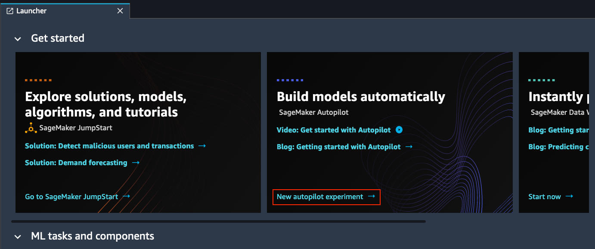
    
#### 5. Enter information for the AutoPilot Job

* **Experiment name** - an unique name to your account in the current AWS Region and contains a maximum of 63 alphanumeric characters. Can include hyphens(-). 
 
  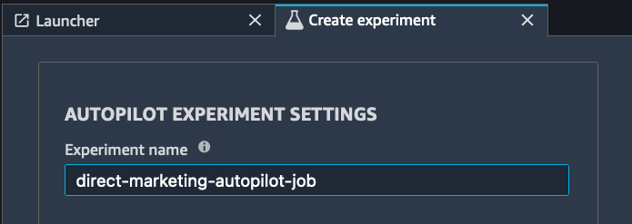
 
  * Type in 'Experiment name', e.g. 'direct-marketing-autopilot-job' 
    
* **Connect your data** - Provide the training data S3 URI.
 
  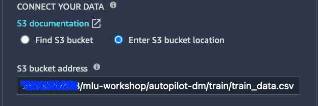
 
  * Select 'Enter S3 bucket location' option
  * Copy & paste the value of `train_data_s3_path` to 'S3 bucket address'. e.g. the value is similar to 's3://sagemaker-ap-southeast-2-123456789012/mlu-workshop/direct-marketing/autopilot/train/train_data.csv' 
  
* **Is your S3 input a manifest file?** - choose 'off' for the lab given we don't need a manifest file include meta data for our training data.

* **target** - the target value or label in the training dataset.
  
  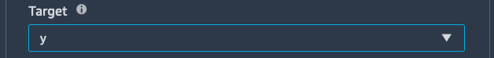
  
  * Click the dropdown box and select field 'y', which is the target value.
 
* **Output data location** - the name of the S3 bucket and directory where you want to store the output data.
 
  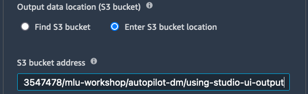
  
  * Select 'Enter S3 bucket location' option
  * Copy & paste the value of `using_studio_ui_output_path` to 'S3 bucket address'. e.g. the value is similar to 's3://sagemaker-ap-southeast-2-123456789012/mlu-workshop/direct-marketing/autopilot/using-studio-ui-output' 
  
* **Select the machine learning problem type** - Autopilot can automatically select the machine learning problem type and you can specify manually. In our exercise, please choose `Binary classification` in dropdox box.
  
  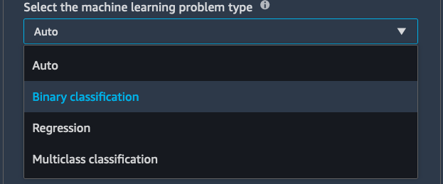
  
  * Please select [`F1`](https://en.wikipedia.org/wiki/F-score) as Object metric. In general, [`F1`](https://en.wikipedia.org/wiki/F-score) is the harmonic mean of the precision and recall in binary classification problem. 
  
* **Do you want to run complete experiment** - You can specify how to run the experiment. 
  
  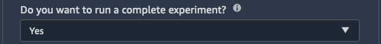
  
  * Please choose **Yes** so that we can kick off Autopilot Experiment and generate model canddiates. For more detail -
   * If you choose **Yes**, Autopilot runs experiments with model training, generates related trials and you will be able to deploy the best model to SageMaker Endpoint service for realtime inference. 
   * If you choose **No**, instead of running the entire experiment, AutoPilot stops running after generating the notebooks for dataset analysis & candidates definitions. 
  
* **Auto deploy** - Autopilot can automatically deploy the best model from an Autopilot experiment to an endpoint (for realtime inference), accept the default Auto deploy value **On** when creating the experiment. Also, please provide the endpoint name. 
  
  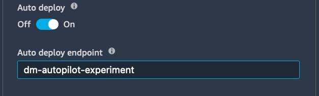
  
  * In our exercise, please input `dm-autopilot-experiment` and the endpoint name will be used later to get predictions from deployed model.
  
* **ADVANCED SETTINGS** - The settings allows you to specify how the experiment should be run. Especially, we want to set the max candidate to be experimented as `10` and accept default values for others.
  
  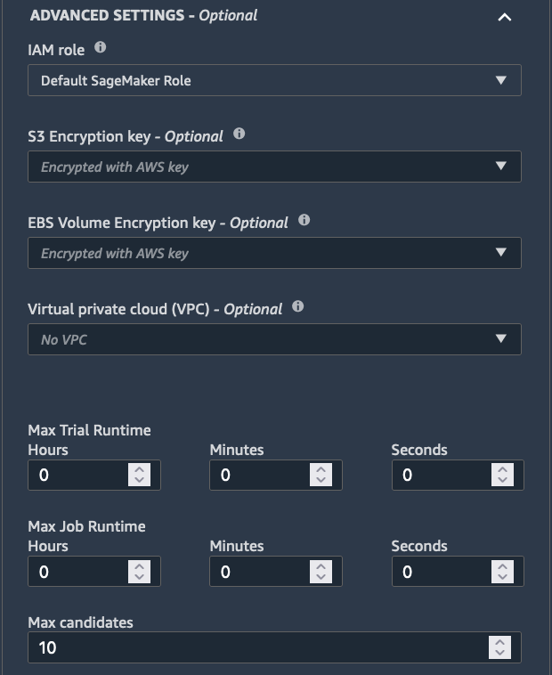
  
  > For experiment purpose and viewing the completed Autopilot Experiment, please do enter 10 - 20 candidates under `Max candidates`, which may take 30-60mins. 
 
* **Auto deploy the best model confirmation?** - If you choose **On** under 'Auto Deploy', Autopilot will prompt a confirmation dialog to remind you that it will generate cost while deploying the model to SageMaker endpoint. In our exercise, please click `Confirm` button.
  
  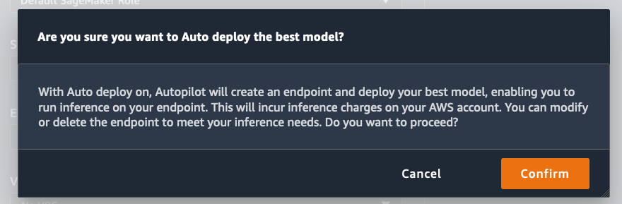
    
* **AutoPilot experiment in progress** - Once the Autopilot experiment is kicked off, you will be able to view the progress of the experiment. It may takes 20-40mins until the job is finished, which depends on the amount the training dataset & the number of candidates you want to experiment. (Autopilot supports up to 250 candidates)
  
  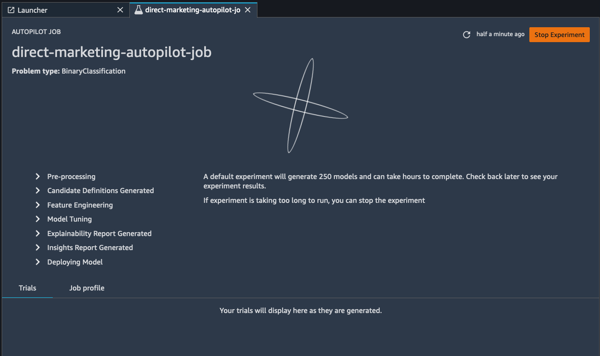
  
#### 6. View Autopilot Experiment Job 

Once the experiment is completed, we will be able to view the related trials and access generate notebooks & deployed endpoint.

* **Autopilot Job Detail** - To access the Autopilot job detail, you may wait under the job finished from the previous step. Or,

 1. click  `SageMaker Resources` icon to open resources pane. 
 2. select `Experiments and trials` to list SageMaker experiments. 
 3. right click the experiment object in the list and select `Describe AutoML Job`.

##### To learn more about the generated notebooks

* Click button `Open candidate generation notebook` to understand more detail on how the model candidates are being explored.
* Click button `Open data exploration notebook` to understand more on how the training data statistics look liks.

 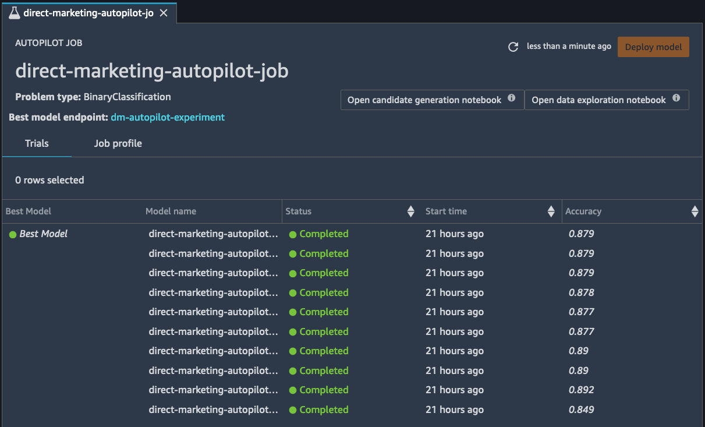
    
##### To view `Best Model`

`Best Model` is the one with the highest performance on the selected `Objective metric`. In our lab, it's the `F1` score.

Please go ahead and right click your mouse on first row with `Best Model` and select `Describe in model details` menu. 

 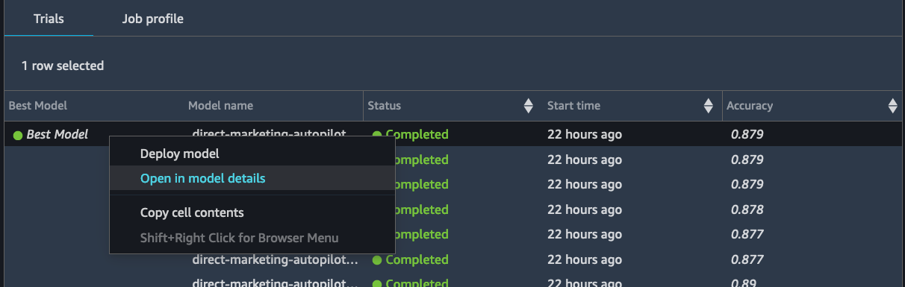
  
With that, the model details page will be shown, especially, for the `Best Model`, Autopilot provides reports for `Explainability` and `Performance` tabs. Please select them to understand more about model explainability and model performance.

 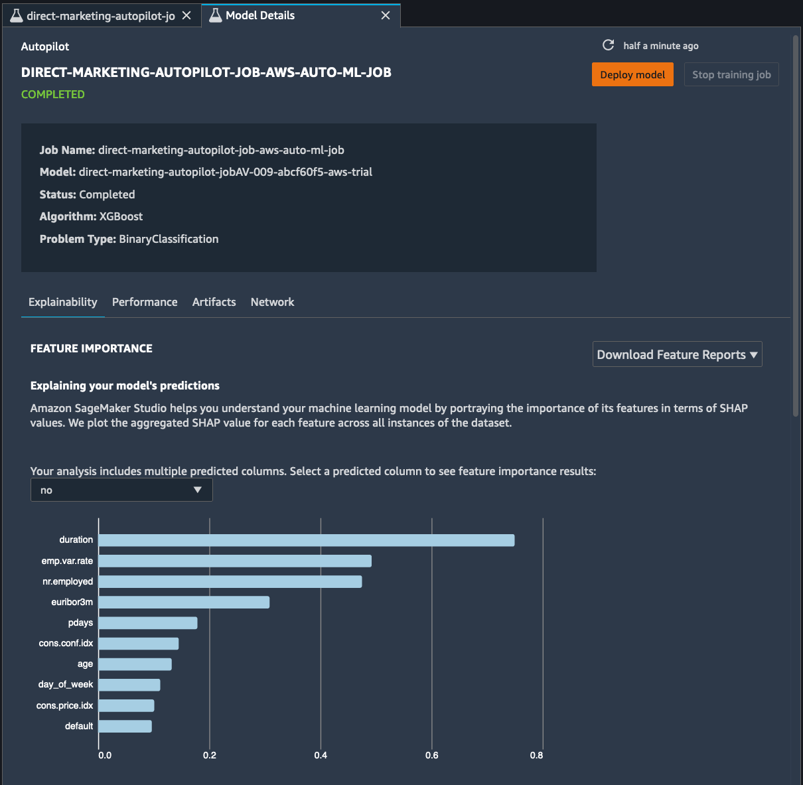
    
#### 7. Test Deployed Model

* Note down the endpoint's name, such as `dm-autopilot-experiment`, which was provided in Autopilot experiment creation.
* In SageMaker Studio, switch tab to the Jupter notebook [02a_sagemaker_autopilot_experiment_with_studio_ui.ipynb](./02a_sagemaker_autopilot_experiment_with_studio_ui.ipynb)
* In the Jupyter notebook, to test the deployed model, execute each of the cells 04, 05, 06, 07 and 08 by pressing `Shift + Enter`
    
#### 8. Clean up resource

* It's generally a good practice to clean up Endpoint resource, which are not in use.
* Please uncomment the lines in last cell and execute them
 
### Using SageMaker Python SDK

In this section, we will create an Autopilot experiment using a Jupyter notebook interface to use the SageMaker SDK instead of the SageMaker Studio UI.  Follow the steps outlined below to open the relevant Jupyter notebook.

#### 1. Open Juypter Notebook

* On the left panel of SageMaker Studio, please click on icon `File Browser` and double click Jupyter notebook [02b_sagemaker_autopilot_experiment_with_sdk.ipynb](./02b_sagemaker_autopilot_experiment_with_sdk.ipynb) under folder `mlu-workshop/1.autopilot/` to open the notebook.
* Follow the notebook and run all cells to experience how to create Autopilot Experiment job with SageMaker Python SDK.
    
## Conclusion
In this Lab, you have learnt how to build a SageMaker Autopilot experiment using both the SageMaker Studio UI and using SageMaker Autopilot SDK.  This concludes Lab 1.  
    
## Next
_Add link to Workshop 3_
    
```python

```
