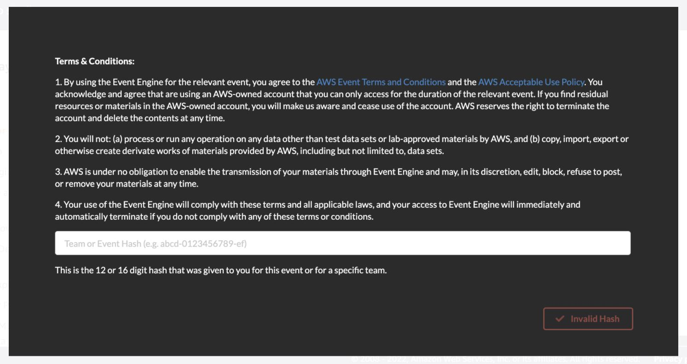
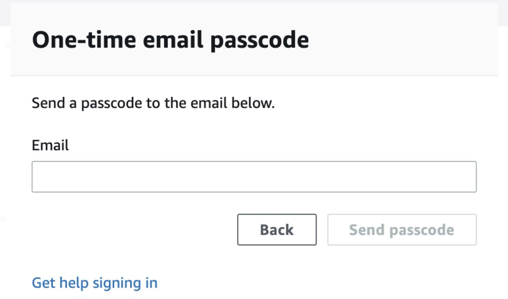
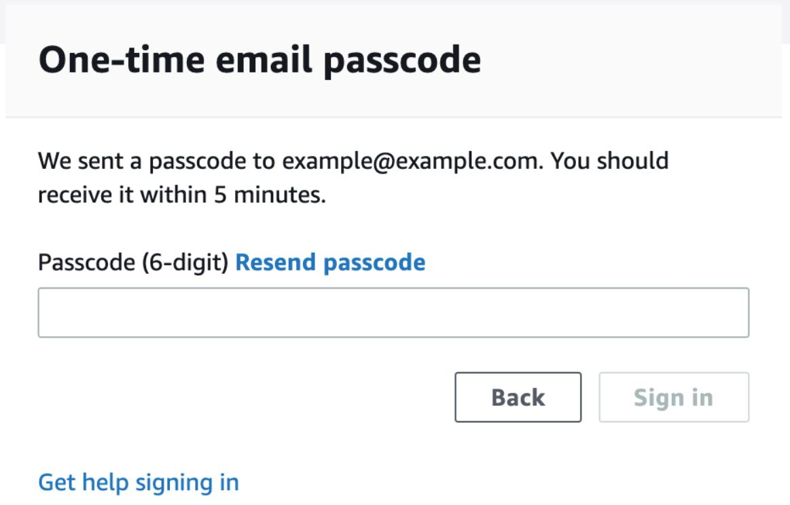
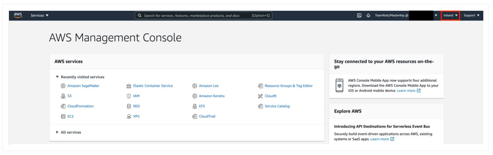
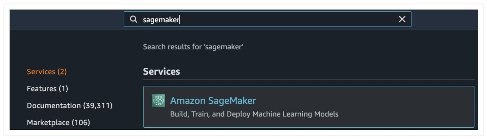
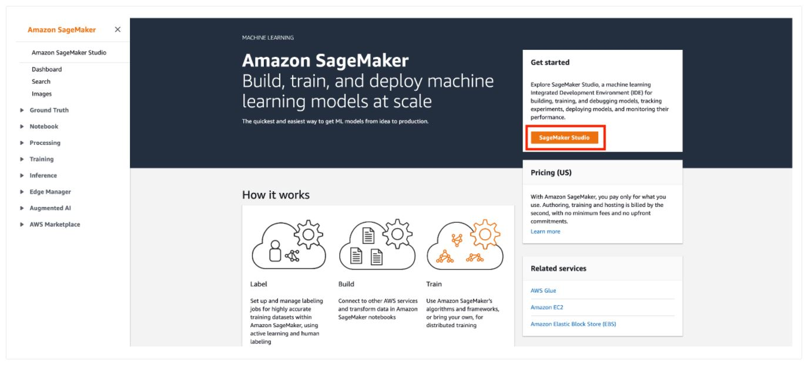
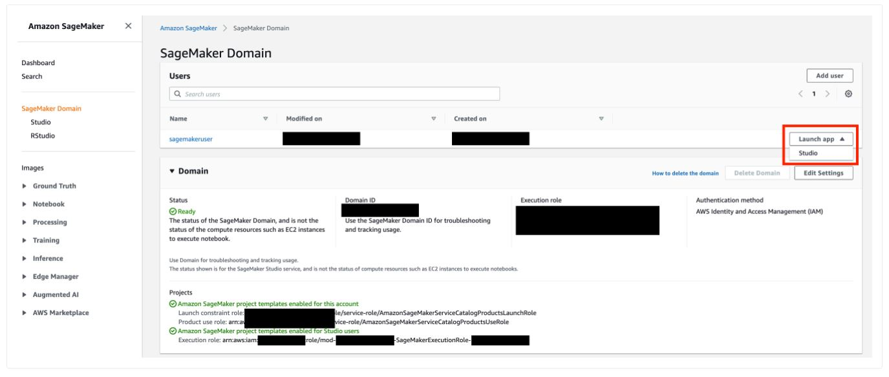
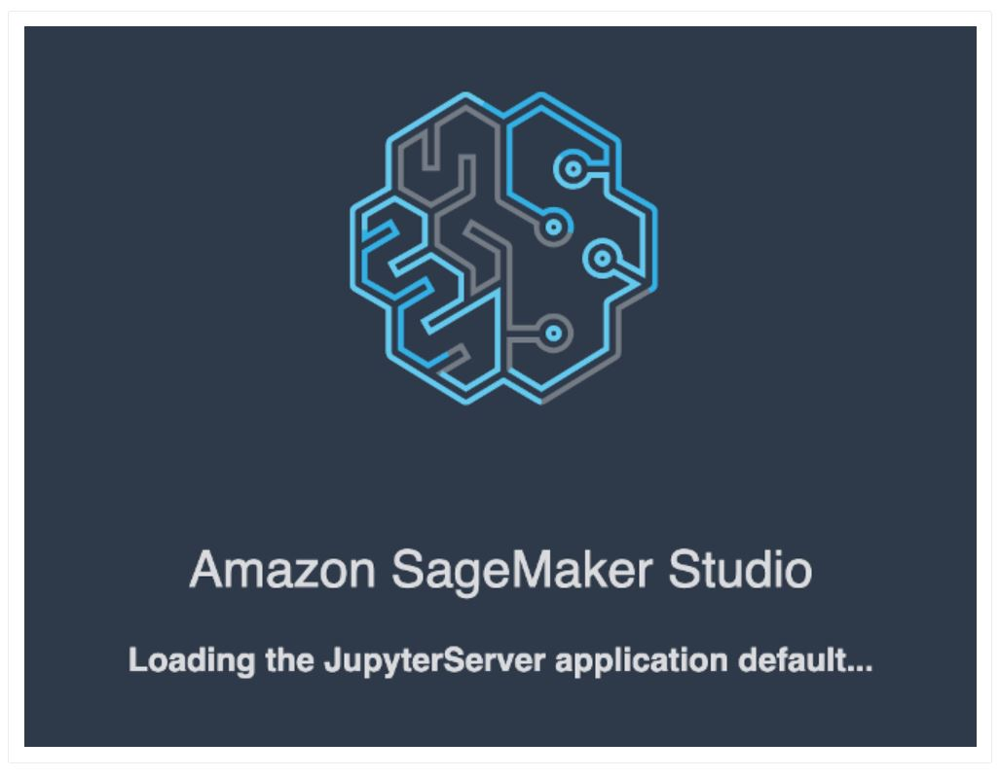
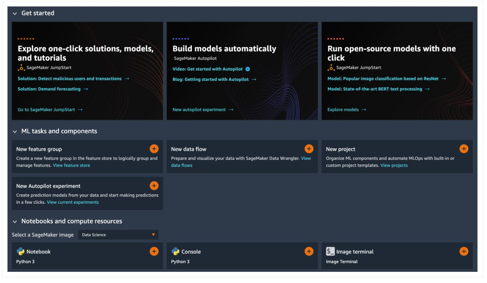
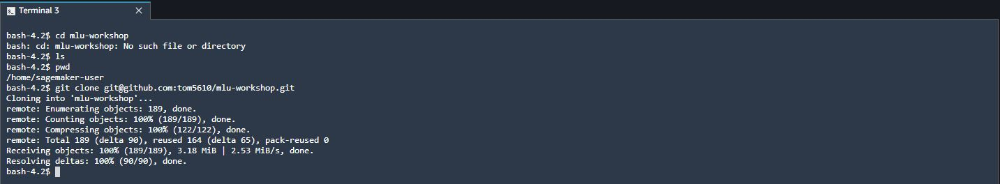

# Machine Learning Days - Australia and New Zealand

---

## Contents

1. [Prerequisite](#Prerequisite)
1. [SageMaker Studio Access](#SageMaker-Studio-Access)
1. [Download Workshop Content](#Download-Workshop-Content)
1. [Starting Workshop](#Starting-Workshop)
    1. [Overview of ML Use-Case](#Overview-of-ML-Use-Case)
    1. [Workshop 01 - AutoPilot with SageMaker](#Workshop-01-AutoPilot-with-SageMaker)
    1. [Workshop 02 - Build ML Pipeline with SageMaker SDK](#Workshop-02-Build-ML-Pipeline-with-SageMaker-SDK)
    1. [Workshop 03 - SageMaker Pipeline with SageMaker](#Workshop-03-SageMaker-Pipeline-with-SageMaker)

---

## Prerequisite


1. Go to ( https://dashboard.eventengine.run/login). You will be redirected to the page below.



2. Enter the event hash you have received from your instructor and click on <b> Accept Terms & Login </b>.

3. Click on <b> Email One-Time Password (OTP) </b>.

4. You are redirected to the following page:



5. Enter your email address and click on <b> Send passcode </b>

6. You are redirected to the following page:



7. Check your mailbox, copy-past the one-time password and click on <b> Sign In </b>

8. You are redirected to the <b>Team Dashboard </b>. Click on <b> AWS Console </b>.

9. On the next screen, click on <b> Open AWS Console </b>.

10. You are then redirected to the <b> AWS Console </b>.


## SageMaker Studio Access
Amazon SageMaker Studio is a web-based, integrated development environment (IDE) for machine learning that lets you build, train, debug, deploy, and monitor your machine learning models. Studio provides all the tools you need to take your models from experimentation to production while boosting your productivity.


1. Open AWS console and switch to AWS region communicated by your instructor.

2. Under services search for <b> Amazon SageMaker </b>.



3. Under <b> Get Started </b>, click on the orange button <b> SageMaker Studio </b>

4. A SageMaker Studio environment should already be provisioned. Click on <b> Open Studio </b> (on the right side of the pre-provisioned <code><b>sagemakeruser</b></code> username).

5. The page can take 1 or 2 minutes to load when you access SageMaker Studio for the first time.

6. You will be redirected to a new web tab for `Amazon SageMaker Studio`that looks like this:

7. You can now close the `Launcher` panel. <br><b>Congratulations!! You have successfully launched SageMaker Studio.</b>

## Download Workshop Content
1. In SageMaker Studio, from the `Menu`, click on `File`, then `New` and choose `Terminal`.
2. In the terminal, type the following command:

    <code> git clone https://github.com/tom5610/mlu-workshop.git </code>
    

3. After completion of step 2, you will see a `mlu-workshop` folder created in the <b> left panel </b> of SageMaker Studio.

## Starting Workshop
### Overview of ML Use-Case

In this workshop, you will work on a typical machine learning (ML) problem which is to predict whether a customer will enroll for a certificate of deposit (CD), after the customer has been contacted through mail, email, phone, etc.  Direct marketing is a common tactic to acquire customers.  Because resources and a customer's attention is limited, the goal is to only target the subset of prospects who are likely to engage with a specific offer.  
    
The model will be trained on a marketing dataset that contains information on customer demographics, responses to marketing events, and environmental factors. Information about this ML task and a version of the data set used is publicly available from the ML repository curated by the University of California, Irvine (https://archive.ics.uci.edu/ml/datasets/bank+marketing).
    
This workshop implements a supervised machine learning problem to solve this problem. The steps include:
 * Downloading training data into Amazon SageMaker
 * Investigating and transforming the data so that it can be fed to Amazon SageMaker algorithms
  * Estimating a model using the Gradient Boosting algorithm
  * Evaluating the effectiveness of the model
  * Deploying the model to an end-point to make on-going predictions    

This workshop explores three different options to implement the supervised ML problem.
 1. Use SageMaker Autopilot to build a ML pipeline to generate the most accurate model to solve the given ML problem
 1. Use a Jupyter notebook to manually implement all the phases of the ML pipeline using SageMaker Python SDK
 3. Use SageMaker Pipeline to orchestrate a ML SageMaker ML jobs

> **_NOTE_** 

> - You can progress through **all** the three workshop exercises one after the other or you can jump to an **indvidual** exercise that you may be interested to learn more about.

> - All workshop exercises will be implemented within Amazon SageMaker Studio environment

> - Before proceeding to your chosen exercise, ensure that you have completed the previous section to download the content of the GitHub repository needed for the workshop.
   
### Workshop 01 - AutoPilot with SageMaker

In this workshop, you will use <b> SageMaker Autopilot </b> to _automate_ the process of building a ML pipeline.  Here, you will learn about two different options to create an `Autopilot Experiment`job:
- Using Amazon SageMaker Studio UI, without writing code
- With code using SageMaker Python SDK for Autopilot

Click on  [Direct Marketing with Amazon SageMaker Autopilot](./1.autopilot/README.md) to complete Workshop 01.


### Workshop 02 - Build ML Pipeline with SageMaker SDK

In this workshop, you will manually generate a machine learning pipeline to build, train and deploy a ML model using SageMaker Python SDK from within a Jupyter notebook.  This workshop will use the SageMaker built-in algorithm XGBoost.  

Click on the link below to work on [Direct Marketing with SageMaker Python SDK](./2.build_train_deploymenttrain/README.md) to complete Workshop 02. 


### Workshop 03 - SageMaker Pipeline with SageMaker
Click on  [Direct Marketing with Amazon SageMaker Pipelines](./3.sagemaker_pipelines/README.md) to complete Workshop 03.


#### Conclusion

Congratulations! You have completed all the workshop exercises in this 1-Day MLU Workshop.

```python

```
# mlu-workshop