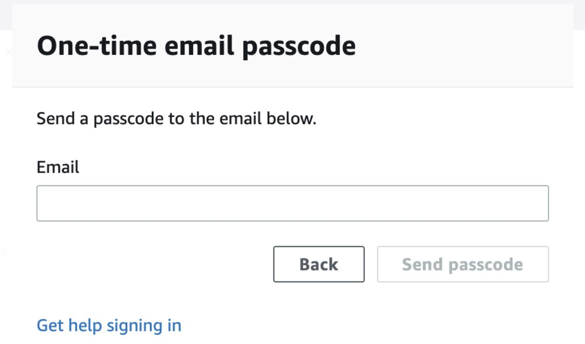
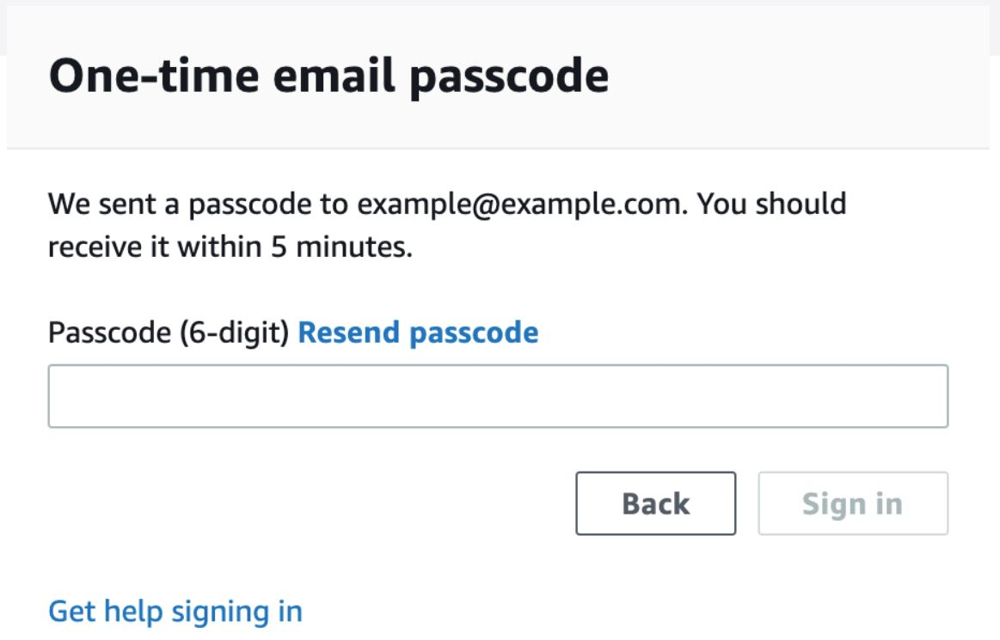
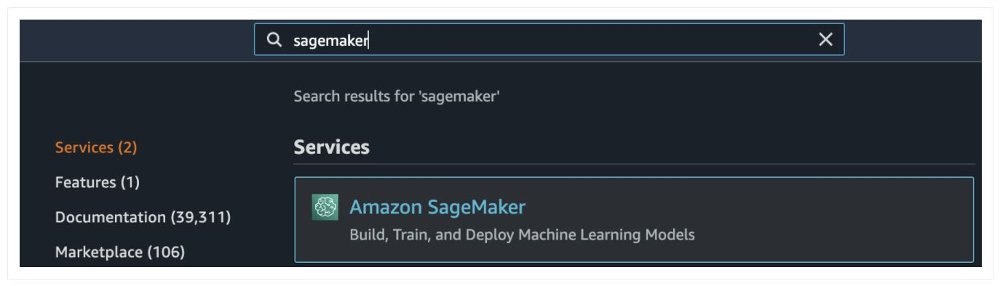
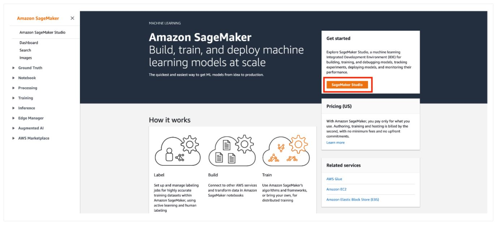
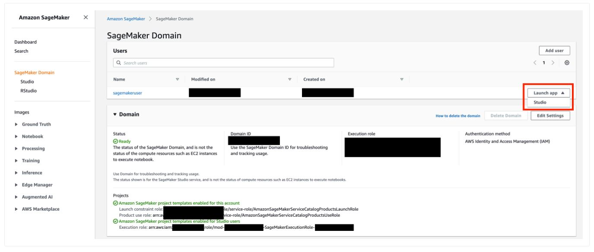
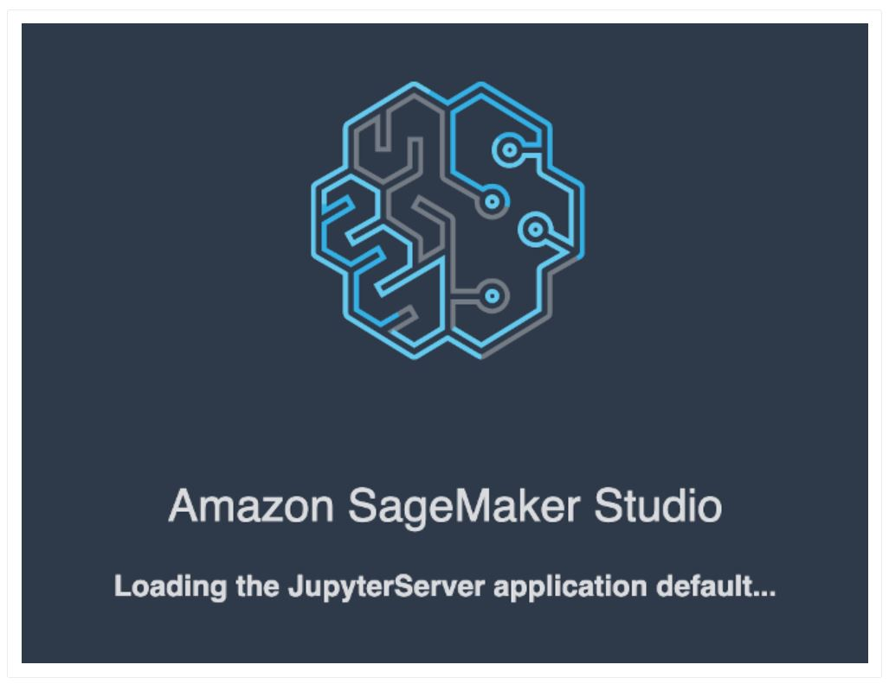
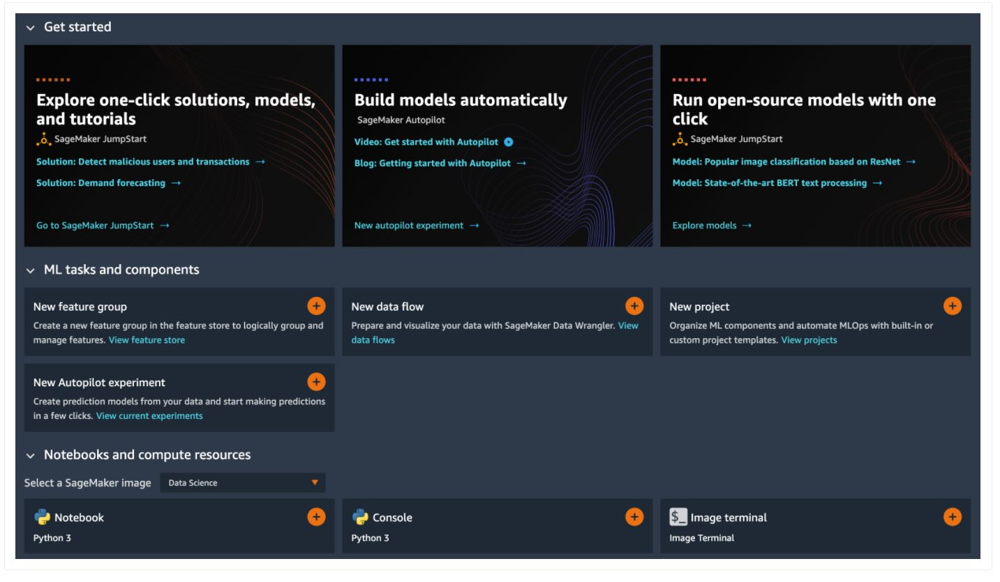
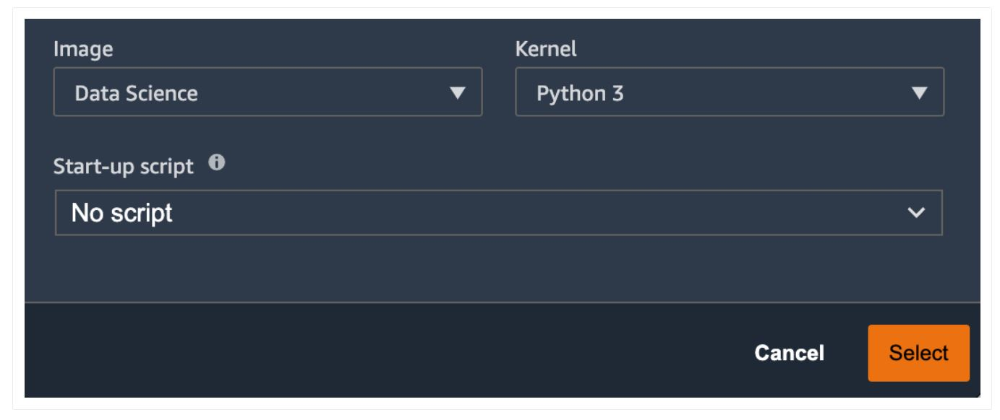
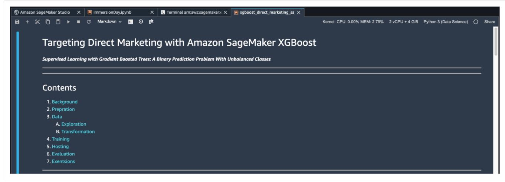

# Machine Learning Days - Australia and New Zealand

---

## Contents

1. [Prerequisite](#Prerequisite)
1. [SageMaker Studio Access](#SageMakerStudio)
1. [Workshop Content](#Content)
    1. [Workshop 01 - Deploy a model with SageMaker](#Workshop01)
    1. [Workshop 02 - AutoPilot with SageMaker](#Workshop02)


---

## Prerequisite


1. Go to ( https://dashboard.eventengine.run/login). You will be redirected to the page below.


2. Enter the event hash you have received from your instructor and click on <b> Accept Terms & Login </b>.

3. Click on <b> Email One-Time Password (OTP) </b>.

4. You are redirected to the following page:



5. Enter your email address and click on <b> Send passcode </b>

6. You are redirected to the following page:



7. Check your mailbox, copy-past the one-time password and click on <b> Sign In </b>

8. You are redirected to the <b>Team Dashboard </b>. Click on <b> AWS Console </b>.

9. On the next screen, click on <b> Open AWS Console </b>.

10. You are then redirected to the <b> AWS Console </b>.


## SageMakerStudio
Amazon SageMaker Studio is a web-based, integrated development environment (IDE) for machine learning that lets you build, train, debug, deploy, and monitor your machine learning models. Studio provides all the tools you need to take your models from experimentation to production while boosting your productivity.


1. Open AWS console and switch to AWS region communicated by your instructor.

2. Under services search for <b> Amazon SageMaker </b>.



3. Under <b> Get Started </b>, click on the orange button <b> SageMaker Studio </b>

4. A SageMaker Studio environment should already be provisioned. Click on <b> Open Studio </b> (on the right side of the preprovisioned <code><b>sagemakeruser</b></code> username).

5. The page can take 1 or 2 minutes to load when you access SageMaker Studio for the first time.

6. You will be redirected to a new web tab that looks like this:

9. You can close the `Get Started` panel. <b>Congratulations!! You have successfully launched SageMaker Studio.</b>


## Content
1. In SageMaker Studio, from the `Menu`, click on `File`, then `New` and choose `Terminal`.
2. In the terminal, type the following command:

    <code> git clone https://github.com/.... </code>
-- Image to be added --
3. After completion of step 2, you will have <b> amazon-sagemaker-mlu-workshop </b> folder created in <b> left panel </b> of the studio.

### Workshop01
  
  In this workshop, you will learn how to use Amazon SageMaker to build, train and deploy a machine learning (ML) model. This workshop will use the SageMaker built-in algorithm XGBoost.  To continue work on this workshop, follow the steps below:  
  1. Click on this “amazon-sagemaker-mlu-workshop” folder and then double click on the last file: “xgboost_direct_marketing_sagemaker.ipynb” notebook.

  2. If you are prompted to choose a Kernel, choose the “Python 3 (Data Science)” kernel and click “Select”.

  3. You will then have the notebook opened. You can verify the Kernel CPU and Memory states on the top right of the notebook.

  4. You have now successfully opened the Juypter notebook for workshop 1. The rest of the workshop 1 can be completed, by following the steps outlined in the Jupyter notebook.

### Workshop02
_To do:  Add details about workshop 02_
  1. Click on this “amazon-sagemaker-mlu-workshop” folder and then double click on the last file: “xgboost_direct_marketing_sagemaker_autopilot.ipynb” notebook.

  2. If you are prompted to choose a Kernel, choose the “Python 3 (Data Science)” kernel and click “Select”.

  3. You will then have the notebook opened. You can verify the Kernel CPU and Memory states on the top right of the notebook.

  4. You have now successfully opened the Juypter notebook for workshop 2. The rest of the workshop 2 can be completed, by following the steps outlined in the Jupyter notebook.


#### Conclusion
In this workshop we have walked through the process of building, training, tuning and deploying an XGBoost Model using SageMaker built-in algorithms. We have also looked at the console view while we performed the training, automated model tuning and hosting the model


```python

```
